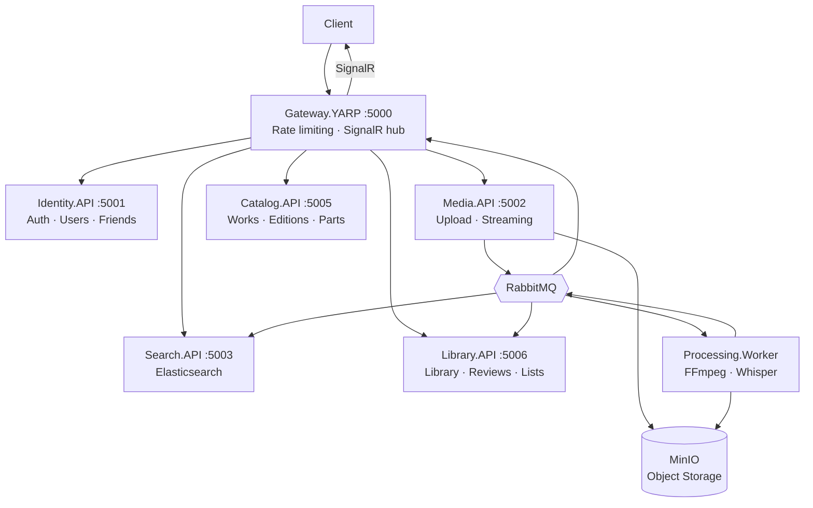

# MediaForge SaaS

[](https://github.com/saturnnn7/MediaForgeAPI/actions/workflows/ci.yml)

**Kyrylo Soprykin** — [LinkedIn](https://www.linkedin.com/in/kyrylo-soprykin/) | [GitHub](https://github.com/saturnnn7)

> Production-oriented audiobook and podcast SaaS platform built with microservices architecture.
> Users upload audio/video content, the system transcodes, transcribes, indexes, and delivers
> in real time. Full social platform: library tracking, reviews, friends, notifications.

## Architecture



## Services

| Service | Port | Responsibility |
|---------|------|----------------|
| Gateway.YARP | 5000 | Reverse proxy, rate limiting (role-based), SignalR hub |
| Identity.API | 5001 | OIDC (Duende IS), JWT RS256, Google OAuth, users, channels, friends, notifications |
| Media.API | 5002 | Pre-signed upload, HLS transcoding trigger, streaming URLs |
| Search.API | 5003 | Elasticsearch full-text search (works, persons, media) |
| Processing.Worker | - | FFmpeg HLS/MP3, waveform, WebVTT subtitles, OpenAI Whisper |
| Catalog.API | 5005 | Series, Works, Editions (multi-narrator), Parts, Persons, Genres, WorkRequests |
| Library.API | 5006 | User library, listening progress, reviews, comments, custom lists |

## Testing the API

**Bruno collection** (`bruno/`) — ready-to-use HTTP request collection covering all flows.
Open Bruno → Open Collection → select `bruno/MediaForge/` → set Environment to `local`.

**E2E test script** — automated full pipeline test:

```powershell
.\scripts\e2e-test.ps1 -AudioFilePath "path\to\audio.mp3"
```

Covers: registration → catalog → upload → FFmpeg processing → library → social features.

## Tech Stack

| Category | Technology | Version |
|----------|-----------|---------|
| Runtime | .NET 8 LTS / C# 12 | 8.0.x |
| Auth | Duende IdentityServer + Google OAuth | 7.0.x |
| Message Broker | MassTransit + RabbitMQ | 8.3.x |
| API Gateway | YARP | 2.3.x |
| Database | PostgreSQL + EF Core 8 | 16-alpine |
| Cache | Redis | 7.4 |
| Object Storage | MinIO | S3-Compatible |
| Search | Elasticsearch | 8.17.x |
| Media Processing | FFMpegCore + FFmpeg | 5.1.x |
| Transcription | OpenAI Whisper | Cloud API |
| Real-time | ASP.NET Core SignalR + Redis backplane | built-in |
| Inter-service | gRPC (Media→Identity) | 2.67.x |
| API Docs | Swashbuckle + Scalar UI | 1.9.x |
| Testing | xUnit + Testcontainers | 3.10.x |
| CI/CD | GitHub Actions | GitHub Actions |
| Containerization | Docker + Docker Compose | Compose v2 |
| Observability | Serilog + Seq + OpenTelemetry | - |

## Key Design Decisions

- **Outbox Pattern** (MassTransit EF Core) - at-least-once delivery, no lost events if broker is down
- **Pre-signed URLs** - media files never transit API servers, uploaded directly to MinIO
- **Pure Domain layer** - no ASP.NET Identity in Domain; IdentityAppUser lives in Infrastructure only
- **Edition system** - multiple narrator teams can record the same Work independently
- **WorkRequest approval** - Creators submit requests, Admins approve before Work is created
- **gRPC for synchronous inter-service** - Media.API validates user on every upload via gRPC
- **Role-based rate limiting** - Admin: 1000/min, Creator: 200/min, Listener: 60/min, Anonymous: 30/min
- **Elasticsearch opt-in** - started via Docker profile `--profile search`; InMemory fallback otherwise
- **FFmpeg concurrency semaphore** - limits parallel FFmpeg processes to 1 (laptop-friendly)
- **Clean Architecture per service** - Domain → Application → Infrastructure → API

## Domain Model

```
Series → Work → Edition (narrator team) → Part → MediaAsset
                                               → PartChapter (timecoded)

User → LibraryEntry (status + rating per Work)
     → ListeningProgress (position per Part)
     → UserList (custom ordered list of Works)
     → Review → ReviewComment (threaded, max depth 2)
              → ReviewReaction (emoji)
     → Friendship
     → AuthorFollow (follow Person/narrator)
     → Notification
```

## User Roles

| Role | Can Do |
|------|--------|
| Listener | Browse, add to library, review, rate, friends |
| Creator | + Submit WorkRequests, upload Editions, manage Parts |
| Admin | + Approve WorkRequests, manage users, moderate content |

## API Documentation

Scalar UI available at each service (requires service running):

- Identity: http://localhost:5001/scalar/v1
- Media: http://localhost:5002/scalar/v1
- Search: http://localhost:5003/scalar/v1
- Catalog: http://localhost:5005/scalar/v1
- Library: http://localhost:5006/scalar/v1

## Prerequisites

- .NET 8 SDK
- Docker Desktop (WSL2 backend on Windows)
- FFmpeg: `winget install ffmpeg`

## Quick Start

### 1. Clone

```powershell
git clone https://github.com/saturnnn7/MediaForgeAPI.git
cd MediaForgeAPI
```

### 2. Generate RSA keys (first time only)

```powershell
dotnet run --project src/Tools/GenerateRsaKeys -- src/Services/Identity/API/keys

cp src/Services/Identity/API/keys/public.pem src/Services/Media/API/keys/public.pem
cp src/Services/Identity/API/keys/public.pem src/Services/Catalog/API/keys/public.pem
cp src/Services/Identity/API/keys/public.pem src/Services/Library/API/keys/public.pem
cp src/Services/Identity/API/keys/public.pem src/Services/Search/API/keys/public.pem
```

### 3. Start infrastructure

```powershell
docker compose -f infra/docker-compose.yml up -d
```

### 4. Apply database migrations

```powershell
.\scripts\apply-migrations.ps1
```

### 5. Run all services (7 terminals)

```powershell
dotnet run --project src/Services/Identity/API      # :5001
dotnet run --project src/Services/Media/API         # :5002
dotnet run --project src/Services/Processing/Worker # background
dotnet run --project src/Services/Search/API        # :5003
dotnet run --project src/Services/Gateway           # :5000
dotnet run --project src/Services/Catalog/API       # :5005
dotnet run --project src/Services/Library/API       # :5006
```

> **Tip:** Use VS Code's compound launch configuration or JetBrains Rider's
> compound run to start all services with one click. See `.vscode/launch.json`.

### Full stack (Docker)

```powershell
docker compose -f infra/docker-compose.full.yml up -d
```

## Running Tests

```powershell
dotnet test MediaForge.sln
```

Testcontainers automatically provisions all required infrastructure.

Current coverage: 39 tests across 6 test projects.

## Project Structure

```
MediaForgeAPI/
├── src/
│   ├── Services/
│   │   ├── Identity/         # Domain / Application / Infrastructure / API
│   │   ├── Media/            # Domain / Application / Infrastructure / API
│   │   ├── Search/           # Domain / Application / Infrastructure / API
│   │   ├── Processing/       # Worker (BackgroundService)
│   │   ├── Gateway/          # YARP + SignalR hub
│   │   ├── Catalog/          # Domain / Application / Infrastructure / API
│   │   └── Library/          # Domain / Application / Infrastructure / API
│   └── Shared/
│       ├── Contracts/        # Integration events
│       └── Infrastructure/   # Base classes, Result<T>, Entity, health checks
├── tests/
│   ├── Identity.IntegrationTests/
│   ├── Media.IntegrationTests/
│   ├── Search.IntegrationTests/
│   ├── Gateway.IntegrationTests/
│   ├── Catalog.IntegrationTests/
│   └── Library.IntegrationTests/
├── infra/
│   ├── docker-compose.yml       # Infrastructure only
│   └── docker-compose.full.yml  # All services
├── scripts/
│   ├── apply-migrations.ps1     # Apply EF Core migrations for all services
│   └── e2e-test.ps1             # End-to-end test script
└── bruno/                       # API collection (Bruno HTTP client)
```
